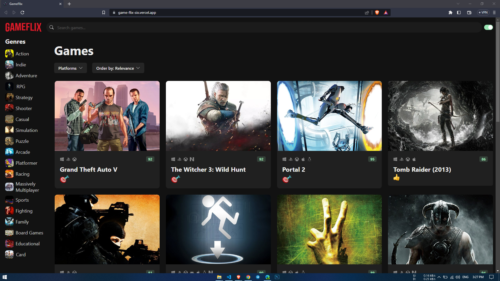

# GameFlix

### GameFlix is a video game discovery web app that helps you find new and interesting games to play. With GameFlix, you can search for games by platform, genre, and more.

**Link to project:** [https://game-flix-six.vercel.app/]

## How It's Made:

**Tech used:** React, TypeScript, HTML, CSS, RAWG API

- Build front-end with React and TypeScript
- Build reusable function components
- Styled components using vanilla CSS, CSS modules, and CSS-in-JS
- Managed component state
- Build forms with React Hook Forms
- Implemented form validation using Zod
